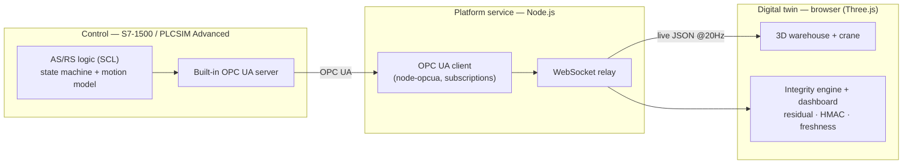

# AS/RS Digital Twin with Cyber-Physical Integrity

A 3-axis automated storage & retrieval crane, controlled by a real Siemens
S7-1500 PLC and driven live into a 3D browser digital twin over OPC UA — with a
**cyber-physical integrity layer** that detects spoofed, tampered, and replayed
telemetry in real time.

> Full stack, built end to end: **PLC control → industrial protocol → platform
> service → digital twin → integrity monitoring.** Not a demo *of* a product — it
> *is* a cyber-physical-integrity product.

**▶ Demo video:** [`docs/demo.mp4`](docs/demo.mp4) — a clean store cycle, then a
spoof / tamper / replay attack tripping the integrity panel, then recovery.
*(Tip: on GitHub you can also drag this file into the README editor to embed an
inline player.)*

**▶ Run it yourself:** open [`twin/asrs_twin_3d_standalone.html`](twin/asrs_twin_3d_standalone.html)
— a single self-contained file, runs by double-click, works offline. It
self-drives a full store cycle and includes the integrity dashboard and
fault-injection controls.

---

## Why this project

Automated warehouses are a textbook cyber-physical system: a PLC commands physical
motion, and a digital layer observes it. The interesting failure mode isn't a
crashed program — it's when the **digital view diverges from, or is spoofed
relative to, the physical reality**. This project builds the whole stack and then
demonstrates detecting exactly that.

It began as a Factory I/O integration; when the simulator's licence became a
blocker, the project pivoted to an **owned, licence-free digital twin** driven by
the S7-1500's built-in OPC UA server — a better long-term asset that's reusable
across any future PLC project.

## Architecture



Four layers, cleanly separated: **control → industrial transport → platform
service → twin + integrity.** The browser never talks to the PLC directly; the
bridge is the trust boundary.

## The cyber-physical integrity layer (the differentiator)

Each mechanism is real, has a live signal on the dashboard, and can be broken on
demand with a fault-inject button — the panel trips **red** and recovers on Clear.

| Mechanism | What it proves | Live attack → result |
|---|---|---|
| **Physics residual monitor** | The reported position matches an *independent* kinematic model of the crane | **Spoof position** injects a false coordinate → the 3D "expected-position" ghost separates from the crane, residual spikes past tolerance, **TRIP** — even though the raw value looks valid |
| **HMAC authenticity** | The telemetry wasn't modified in transit | **Tamper value** alters a field → HMAC-SHA256 (WebCrypto) recomputation mismatches the signed value → **FAIL** |
| **Freshness / replay** | The data is current, not a rewound/replayed frame | **Replay frame** freezes the monotonic sequence counter → data age climbs → **STALE / REPLAY** |
| **Secured channel** *(roadmap)* | The OPC UA session itself is authenticated & encrypted | Status shown today; hardening to Sign & Encrypt + X.509 certs is a PLC-config step |

The residual monitor is the centrepiece: it's the software realisation of
"the physical doesn't match the digital," which is the core problem in
cyber-physical integrity.

## Tech stack

- **PLC / control:** Siemens **TIA Portal V17**, **S7-1500** (CPU 1511-1 PN,
  firmware V2.9), **SCL**; runs in **S7-PLCSIM Advanced** (OPC UA reachable over
  TCP/IP). A **WinCC Comfort** HMI and a full **ladder** design accompany the SCL.
- **Protocol:** the S7-1500's **built-in OPC UA server** (vendor-neutral,
  industry-standard).
- **Platform service:** **Node.js** + **node-opcua** (subscriptions) + **ws**
  (WebSocket relay).
- **Digital twin:** **Three.js** (WebGL) — parametric rack, stacker crane, PBR-ish
  materials, image-based lighting, soft shadows; bundled into a single offline file.
- **Integrity crypto:** **HMAC-SHA256** via the Web Crypto API; an independent
  kinematic reference model for the residual monitor.

## Repository structure

```
├── plc/
│   └── 20_TwinData.scl          # DB_Twin + FB_TwinPump — twin data model & crane sim (SCL)
│   └── ...                       # sequencer, axis/gripper/barcode/SQL blocks, UDTs, ladder design
├── bridge/
│   ├── bridge.js                 # OPC UA client → WebSocket relay
│   ├── package.json
│   └── test.html                 # quick raw-stream viewer
├── twin/
│   ├── asrs_twin_3d.html         # editable source (imports Three.js)
│   ├── asrs_twin_3d_standalone.html   # ← self-contained, double-click demo
│   └── build_standalone.js       # bundles Three.js into the standalone file
└── docs/                         # design docs, architecture, case study, status report
```

## Getting started

### Just the twin (no PLC needed)
Open **`asrs_twin_3d_standalone.html`** in a browser. It runs in **Demo mode** —
a self-driving crane plus the full integrity dashboard. Use the **Record** button
to export a `.webm` clip; use the fault-inject buttons to trip the integrity panel.

### The full live pipeline
1. **PLC:** in TIA Portal, generate `DB_Twin` + `FB_TwinPump` from `20_TwinData.scl`,
   call `FB_TwinPump` in `Main [OB1]`, enable the CPU's OPC UA server, and download
   to **PLCSIM Advanced** (endpoint `opc.tcp://192.168.0.1:4840`).
2. **Bridge:** `cd bridge && npm install && npm start` — subscribes to the PLC and
   serves live JSON on `ws://localhost:4841`.
3. **Twin:** open the twin; it auto-detects the live bridge (green dot) and the
   crane is now driven by the real PLC.

## Engineering highlights

Real problems, systematically diagnosed — the kind of debugging the role is about:

- **Fault isolated across five layers.** A dead output was chased through PLCSIM,
  couplers, and the program before being proven to be a **licensing** issue, not an
  engineering one — the entire control stack was demonstrably correct.
- **Simulator-specific timing.** A self-resetting IEC `TON` did not advance in the
  PLCSIM Advanced instance, and a `RUNTIME`-based fix wouldn't generate from source;
  the working solution paces the simulation on a plain **scan counter** — robust and
  portable.
- **Motion that silently wedged.** A fixed-step position ramp **oscillated** around
  any target the step didn't divide evenly (hoist pitch ÷ step ≠ integer), freezing
  the cycle at the first upper-row cell. Fixed by **clamping each axis to target
  within one step** so it can never overshoot.
- **Right tool per job.** Continuous motion maths and the integrity crypto live in
  SCL / the platform service; boolean interlocks, sequencing and safety belong in
  ladder — a deliberate split, not an accident.

## How this project compares

Measured against the projects it will sit beside, this one occupies an unusual
middle ground — between a strong PLC portfolio piece and applied OT-security
research.

- **vs the typical portfolio project** (Factory I/O + TIA Portal automated
  warehouse — the most common build): those drive a *rented* 3D scene through a
  proprietary simulator's driver. There's no custom twin, no protocol layer the
  author built, and nothing on integrity. This project builds the twin, the OPC UA
  bridge, and the integrity monitor from scratch, and owns the whole stack.
- **vs a commercial digital twin** (e.g. [realvirtual.io](https://realvirtual.io/en/)
  and its open-source Three.js browser HMI
  [realvirtual-WEB](https://github.com/game4automation/realvirtual-WEB)): the
  architecture is remarkably similar — a PLC streamed over WebSocket into a Three.js
  view. Commercial tools win on photoreal fidelity and physics (collision, sensors);
  they need a Unity backend and an enterprise stack, whereas this runs as one
  self-contained file. Notably, even they don't foreground integrity monitoring.
- **vs open-source simulators** (e.g.
  [Open-Industry-Project](https://github.com/Open-Industry-Project/Open-Industry-Project),
  Godot + OPC UA): comparable twin idea, heavier framework, and again no integrity
  layer.
- **where the differentiator actually lives — research.** The independent-model
  approach used here to catch spoofing is an active academic and standards topic,
  e.g. [NIST's Digital-Twin-Based Cyber-Attack Detection Framework](https://www.nist.gov/publications/digital-twin-based-cyber-attack-detection-framework-cyber-physical-manufacturing)
  and [Digital-Twin approaches for detecting cyber–physical attacks in ICS](https://www.mdpi.com/2076-3417/14/19/8665).
  This project is a hands-on, visual implementation of what those papers describe.

**Honest gaps:** on visual polish and physics (collision, sensor emulation),
commercial tools and Factory I/O lead — that's the target of the optional photoreal
pass. The current twin is a kinematic model, telemetry (read-only), with the
integrity engine running browser-side; moving it into the bridge (the platform
trust boundary) is the productionization step.

> **Real-world reference.** A commercial AS/RS stacker crane
> ([BlueSword](https://www.bluesword.com/solutions/products/stacker-crane), for
> example) travels up to **300 m/min** horizontally and **30–180 m/min** vertically,
> reaches **6–45 m** of rack, carries **1.5 t** pallets, and **auto-corrects
> position to ±5 mm** — with IoT **condition monitoring** of mast tilt, rail
> alignment and structural health, plus TÜV Rheinland **PLd** safety. This twin's
> kinematics and 9×6 / 1.5 m-pitch rack sit squarely in that envelope. The residual
> monitor here is the same *class* of "reported vs actual position" check a real
> ±5 mm auto-correction system performs — repurposed from mechanical correction to
> **integrity**: real systems monitor whether the machine is *healthy*; this one
> adds the missing layer — whether the *telemetry about the machine is trustworthy*,
> catching spoofed or replayed data that condition monitoring would miss.

## Roadmap

- Record the packaged demo video and publish.
- Harden the OPC UA channel to **Sign & Encrypt** with X.509 certificates.
- Move the integrity engine from the browser into the **bridge** (compute trust at
  the platform boundary), with a SIEM-style audit export.
- Add a **ladder supervisory layer**: safety/interlock string, Auto/Manual + Start/
  Stop/Reset, an enable gate to the crane, a motion watchdog, and status lamps.
- Optional photoreal pass (glTF assets, richer lighting).

---

*Built as a portfolio piece for automation-engineering roles and as a demonstrator
for a cyber-physical-integrity focus. Platform: Siemens S7-1500 · TIA Portal V17 ·
SCL + Ladder + WinCC · OPC UA · Node.js · Three.js.*
